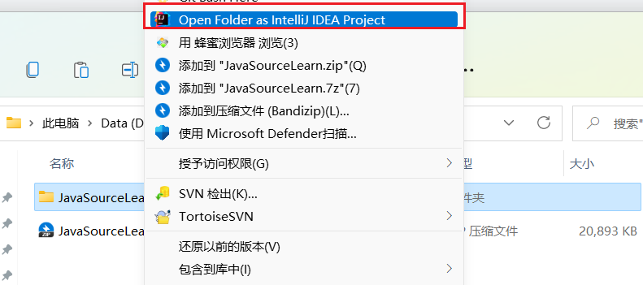
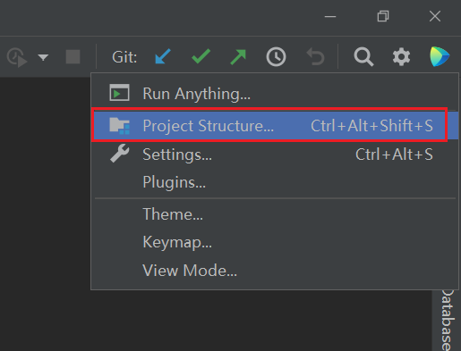
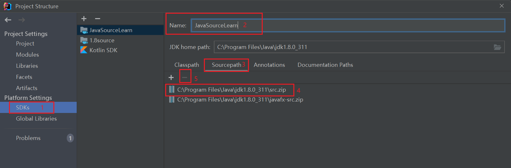
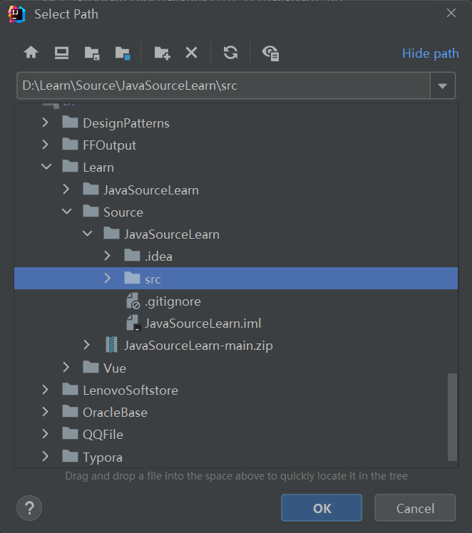
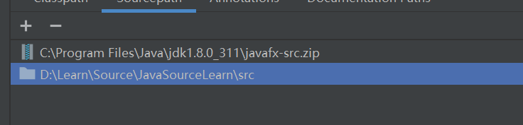
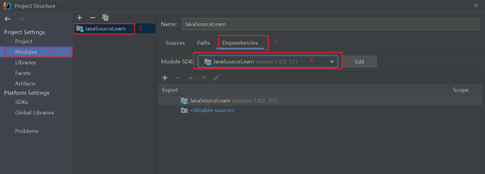
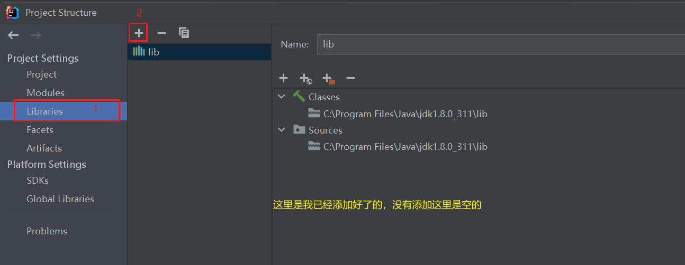
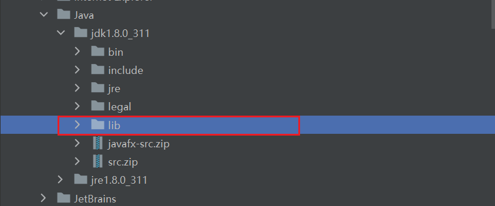
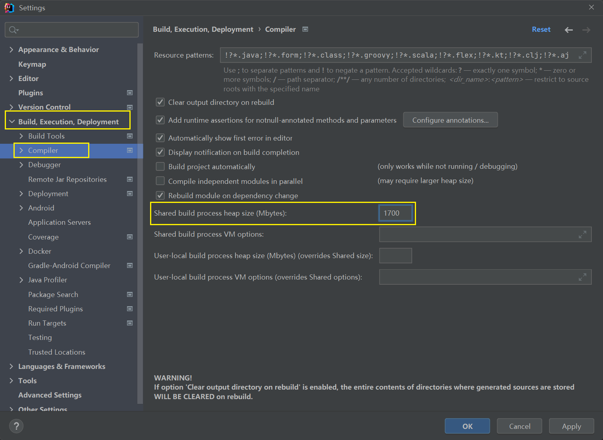
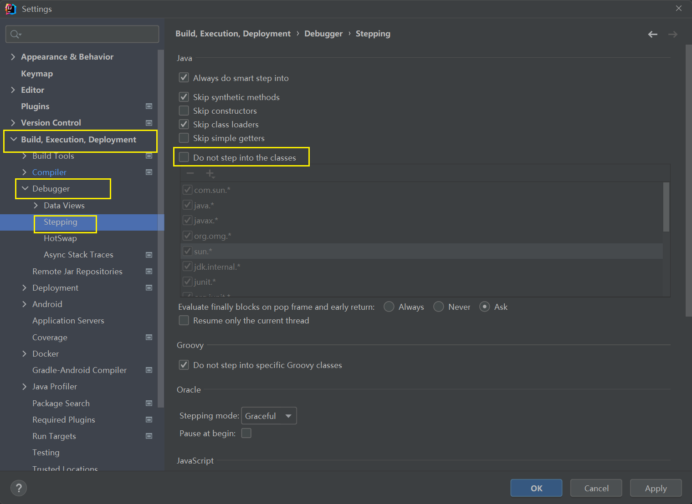

# 源码构建

前置要求

- 了解使用git
- idea IDE
- java1.8

## 1. 下载源码

- 在本地创建一个文件夹用于存放源码
- 克隆该仓库，下载zip再解压会快一点

- 使用idea打开
  

## 2.配置环境

1. 添加javaSDK为自定义SDK
   
   
2. 在自己原先java1.8的SDK包下进行修改，删掉原本提供的src.zip包，然后添加自己的src目录
   1. 删除src
   
   2. 添加自己的源码目录
      
      
      
      
   3. 修改模块中使用自己设定的SDK
      
   
   4. 添加一个lib，（因为编译的时候，会有一个tool包找不到）
      
   
      

## idea配置

1. 为了防止编译报错资源不足，这里需要修改一下编译环境，进入settings-》Build,Execution,Deployment-》Compiler-》Shared build process heap size（Mbytes） =  `1700`
   
2. 为了在Debugger的时候能够跳转到菜单下一级，Debugger-》Stepping-》Do not step into the classes的勾取消掉。
   

## 运行起来

1. 来到Main方法，运行起来，等待一段很长很长时间的编译即可。
